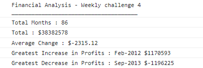

# Console-Finances-WC4
Repository for weekly challenge 4 - display of JS ability on manipulating data.

## Description

Part of the Skills for life Bootcamp course hosted by Trilogy Ed Services 2023.

We were given the array in the index.js file and asked to perform various manipulations using script to output certain results from the data.

\
*Desired result of project.*

The main purpose of the exercise was to how the use of variable creation, forloops and basic JavaScript operations.

The exersise was designed to replicate a real life scenario of a company asking you to perform data manipulation that will update with the array (future proofing).

## Installation

The repo is made up of a HTML and JS Script file. Please use the dev tools in browser inorder to see the console logs.

## Usage

Below are the 3 main uses of this repository:

    -The main purpose for this project is to display proficency in JS
    -You could also replace the data with your own
    -It is also for use as a study aid in understanding JS

## Credits

Done using the data provided by Trilogy education for the Skills Bootcamp 2023

## License

Please see license document in repo.

---
